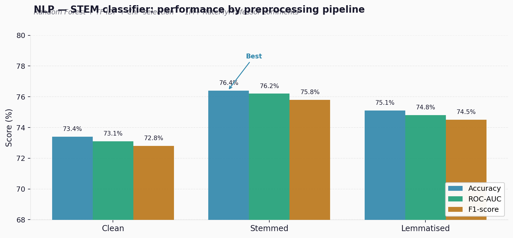
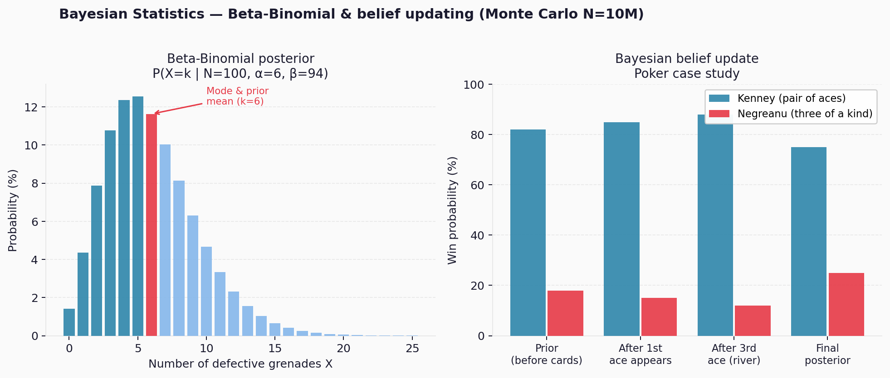
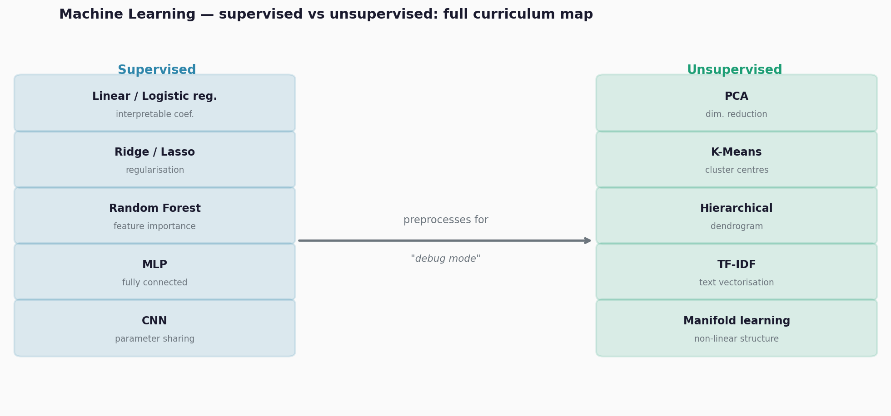

# Columbia QMSS — Coursework

M.A. Quantitative Methods in the Social Sciences, Columbia University
Major GPA: 4.0 · A+ in NLP & Machine Learning · Overall GPA: 3.92 · 2024

## Modules

| Folder | Topics |
|--------|--------|
| `Bayesian Statistics` | Normal/Gaussian density · Beta-Binomial · Zero-Inflated Poisson · Hierarchical models |
| `Data Science` | Visualisation · Regression · Double-interaction variables · Logistic models · Pooled OLS |
| `Machine Learning` | Penalized regression · Classifiers · K-Means/PCA · Neural networks (Keras) |
| `Natural Language Processing` | VADER · NLTK classifiers · TF-IDF + Chi² · Random Forest |
| `Social Network Analysis` | Ego-network measures · Centrality · Community detection |
| `Time Series Analysis` | Panel data · Survival analysis (Cox) · ARIMA |

---

## Featured labs

### 🗣️ NLP — STEM/Non-STEM classifier (RateMyProfessor, 1M+ comments)

Text preprocessing pipeline (clean / stem / lemma) → TF-IDF vectorisation →
Chi² feature selection → Random Forest classifier with GridSearchCV.

Stemmed pipeline achieves the best results across all metrics.
Key methodological choice: `SelectKBest(chi2)` removes low-information tokens
before classification — reduces dimensionality without losing discriminative signal.

Stack: `sklearn` · `VADER` · `nltk` · `pickle`

---

### 📐 Bayesian Statistics — Defective grenades + poker belief updating

**Part 1 — Beta-Binomial Monte Carlo (N=10M draws)**
Prior: X ~ BetaBinomial(N=100, α=6, β=94) encoding a belief of ~6% defect rate.
Sample n=31 grenades → P(k=2 defective) = **18%** · P(≤3 safe remaining of 69) = **63%**.

**Part 2 — Bayesian belief update as a poker case study**
Each card revealed on the river is new evidence. Win probabilities are updated
using Bayes' theorem — illustrating how rational agents update beliefs with
sequential information, exactly as a trader updates a position view.

Stack: `R` · `extraDistr` · `dplyr`

---

### 🤖 Machine Learning — Full curriculum final

Covers the complete supervised / unsupervised taxonomy:

Key finding: **unsupervised learning as "debug mode"** — PCA and K-Means
reveal hidden structure in X, remove multicollinearity and noise, then
supervised models trained on the cleaned features generalise better.
Neural network architecture code (MLP and CNN) written from scratch in Keras/TensorFlow.

Stack: `TensorFlow` · `sklearn` · `numpy`

---

**Jean Treves** — [LinkedIn](https://www.linkedin.com/in/jean-treves-bbaa91257/) · [GitHub](https://github.com/Raeus1901)

> Master thesis (FinBERT × SARIMAX): [finbert-sarimax-energy-forecasting](https://github.com/Raeus1901/finbert-sarimax-energy-forecasting)
